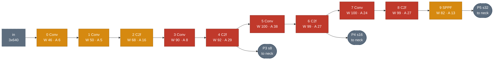
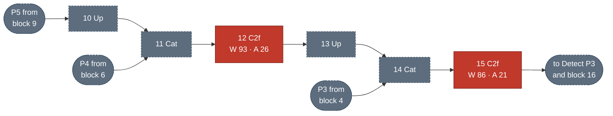
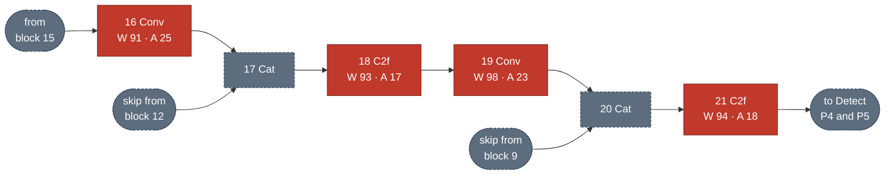
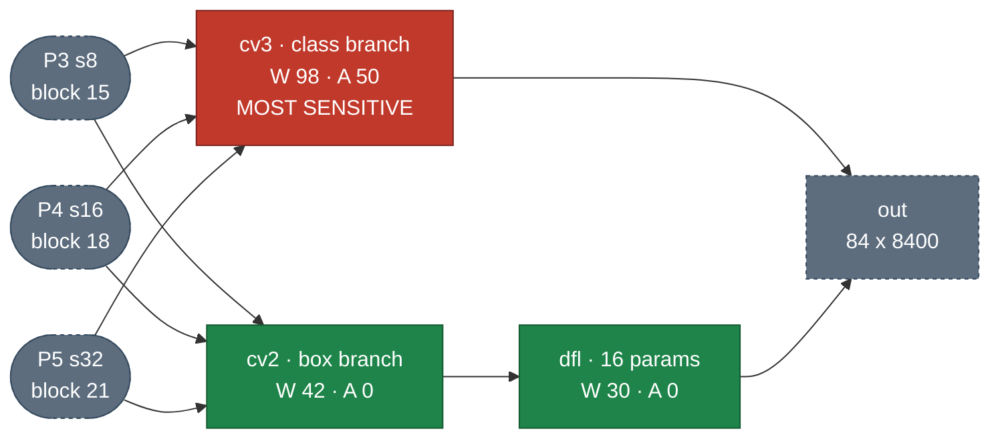

# Hardware Fault Injection in YOLOv8

Measuring how single-bit hardware errors affect object detection quality. Injects
into **weights** (memory faults) and **activations** (buffer / compute faults), and
separates **silent** corruption from **detectable** corruption.

Target: YOLOv8n, 3,151,904 parameters after BatchNorm fusion, 64 `nn.Conv2d`
layers, 100,860,928 bits. Conv weights (the injection targets) are 3,146,176.

Python 3.11.9 (pyenv) · Ultralytics 8.4.156 · PyTorch 2.5.1+cu121 · RTX 4070

| golden baseline | images | mAP50-95 |
|---|---|---|
| `coco128` | 128 |  0.4451 |
| `val2017` | 5,000 | **0.3684** |

Sweeps use coco128 for speed (~1.5 s per evaluation vs 26 s); 0.3684 is the number
to report.

**Layout**

```
src/         injection harness      fi_lib.py  campaign.py  campaign_act.py
analysis/    reporting tools        summarize.py  plot_layers.py  analyze.py  structure.py
demos/       superseded one-off scripts from the exploratory phase
results/     campaign CSVs, logs and plots
```

```bash
./src/campaign.py 16 30                 # weight campaign at bit 30
./src/campaign_act.py persistent 16 30  # activation campaign
./analysis/summarize.py                 # all cross-campaign tables
./analysis/plot_layers.py --bit all     # per-block plot, averaged over bit positions
```

Scripts derive paths from their own location, so the tree can be moved. Harness
details (correctness guarantees, bugs found, full reproduction steps) are in
**[IMPLEMENTATION.md](IMPLEMENTATION.md)**.

---

# Method

## Fault model

Single-bit flips in FP32 values, three injection sites:

| site | models | injection | 
|---|---|---|
| **weights** | bit rot in weight memory (no ECC) | write to `layer.weight.data` | 
| **activations, persistent** | stuck-at fault in an activation buffer | forward hook, every pass, all batch elements | 
| **activations, transient** | single-event upset during one inference | forward hook, fires once | 

Out of scope:

- compute-unit faults (needs NVBitFI)
- control-path and addressing faults
- multi-bit upsets from a single particle
- input-image / frame-buffer faults 

ECC on weight memory would correct
exactly the weight faults modeled here, which argues for pushing toward the compute
path next.

## Bit position sensitivity

FP layout  is `[31] sign | [30:23] exponent | [22:0] mantissa`. Damage is governed by
**magnitude, not bit position alone**, because a flip's direction depends on whether
the bit is already set:

- `|v| < 2` → exponent < 128 → bit 30 **clear**, so flipping *sets* it: ×2¹²⁸,
  catastrophic. Bits 23–29 are mostly already `1`, so flipping them shrinks the value.
- `|v| ≥ 2` → bit 30 **set**, so flipping it shrinks; but bit 29 is now clear (all weights are less than 2^65), and
  flipping that multiplies by 2⁶⁴, catastrophic.
- `|v| ∈ [1,2)` → exponent exactly 127 → setting bit 30 gives 255, the **NaN
  encoding**. NaN appears directly, with no overflow step.

| population | n | mean \|v\| | max \|v\| | \|v\| ≥ 2 | bit 30 clear |
|---|---|---|---|---|---|
| all conv weights | 3,146,176 | 0.062 | 17.49 | 0.01% | 99.95% |
| `model.0.conv` | 432 | n/a | 17.49 | **43.3%** | 56.7% |
| activations @ `model.15.cv2.conv` | 2.2M | 0.162 | 7.60 | 4.7% | 95.3% |

`model.0.conv` is a magnitude outlier: BatchNorm fusion scales first-layer weights
up, so bit 29 is catastrophic there and essentially nowhere else among weights.
Activations are more exposed at bit 29 than weights (4.7% vs 0.01% at `|v| ≥ 2`).

Bits swept are **31, 30, 29, 24, 23, 22**: sign, exponent MSB, the
magnitude-dependent bit, two mid-exponent bits, mantissa MSB. Mantissa bits below
22 change a value by < 0.1%.

## Injection mechanism

```python
# weights: mutate the parameter tensor
flat = layer.weight.data.view(-1)
orig = flat[idx].clone()                              # .clone() is essential
flat[idx] = (flat[idx].view(torch.int32) ^ (1 << bit)).view(torch.float32)
...
flat[idx] = orig                                      # restore

# activations: intercept with a forward hook
def hook(mod, inp, out):
    n, c, h, w = out.shape
    y, x = int(fy * h), int(fx * w)
    out[:, chan % c, y, x] = flip(out[:, chan % c, y, x], bit)   # ALL batch elements
    return out
```

`Tensor.view(dtype)` is a **reinterpret cast**. XOR with
`1 << bit` toggles one position.

Injection happens **after `model.fuse()`**
- `model.fuse()` *folds* each BatchNorm layer into the convolution before it
- Compare both results after normalization, more tracable

Activation targets are `(channel, y_frac, x_frac)` rather than flat indices.

## Sampling design
Inject one bit corruption each time:

Each run tests:
- 64 conv layers × 
- 16 randomly chosen targets (`SEED = 0`) x
- Six possible bit positions × 
- Three campaigns (weight, persistent activation, transient activation)

= **18,432 injections**.

The seed is fixed and the RNG constructed after it, so every bit tested hits the
identical target set, so differences are attributable to bit position alone.

Sampling is **uniform per layer, not per parameter**: `model.22.dfl.conv` (16
params) gets the same 16 injections as `model.7.conv` (294,912). 
- That gives every
layer equal statistical power, but means a whole-model rate cannot be read off these
numbers without reweighting by parameter count.

## Metrics

Two are recorded per injection, because **they disagree, and the disagreement is a
finding**.

**1. mAP50-95**: COCO mean Average Precision over IoU standards of `0.5:0.05:0.95`.
- "mAP-critical" means the bit flip causes `mAP < 0.5 × golden`.
- It **systematically under-reports**: losing one object out of 50 barely moves a dataset
average.

**2. Error class** (per image): golden vs corrupted detections

| Error class | Condition | Detectable at runtime? |
|---|---|---|
| **DUE** | Any entry in output tensor contains NaN or Inf | **yes**, check and re-run |
| **SDC** | Clean output, but objects have lost/phantom/class flip | **no** |
| **Benign** | all objects match, correct classes, boxes drifted (IoU < 0.99) | n/a |
| **Masked** | detection sets identical (all matched at IoU ≥ 0.99) | n/a |


- DUE takes precedence whenever
NaN/Inf is present
<!-- - Detection outcomes recorded alongside the error class: `object_lost` (object
vanished), `phantom` (spurious detection), `class_flip` (matched box, wrong label).
These are a **separate axis**: they occur under DUE as well as SDC. At transient
bit 30, 167 DUE rows had `object_lost`. -->


<!-- `sdc_critical` fires if **any** of the 16 subset images shows an SDC, making it
sensitive but an upward-biased rate. Per-image counts (`v_masked`, `v_benign`,
`v_sdc`, `v_due`) are in every CSV; use those for a rate. -->

# Results

18,432 injections: 3 campaigns × 6 bit positions × 1,024, on coco128.
All tables below come from `./analysis/summarize.py` and use the **per-image rate**,
the fraction of individual golden-vs-corrupted image comparisons that were SDC or DUE.
<!-- DUE. The alternative "any of 16 images" flag (`sdc_critical`) runs 4–12× higher and
is not used here. -->

## Per Bit Position

> SDC and DUE are properties of the fault *site*, not the layer

| bit | field | weight SDC | weight DUE | persist SDC | persist DUE | transient SDC | transient DUE |
|---|---|---|---|---|---|---|---|
| 31 | sign | 2.8% | **0.0%** | 4.8% | **0.0%** | 4.8% | **0.0%** |
| **30** | exp MSB | **83.0%** | 5.9% | 22.5% | **30.5%** | 22.0% | **31.2%** |
| 29 | exp | 2.8% | **0.0%** | 5.1% | **0.0%** | 5.6% | **0.0%** |
| 24 | exp | 2.4% | **0.0%** | 0.2% | **0.0%** | 0.0% | **0.0%** |
| 23 | exp | 1.2% | **0.0%** | 0.0% | **0.0%** | 0.1% | **0.0%** |
| 22 | mant MSB | 0.5% | **0.0%** | 0.0% | **0.0%** | 0.0% | **0.0%** |

**1. Weight faults are silent; activation faults are loud.** At bit 30, weight faults
are 83.0% SDC against 5.9% DUE. Activation faults invert it: 22.5%
SDC against 30.5% DUE.

- Mechanism: convolution weights are typically less than 1, so the corrupted weight stays large-but-finite and propagates as plausible garbage. A
corrupted activation is evaluated against many different images, and any image whose
value at that location lands in `|v| ∈ [1,2)` hits the `E=255` NaN encoding directly.


**2. DUE is exactly 0.0% at every bit except 30**. Only bit 30 can carry an
exponent to 255.  **Other bit flip
positions are 100% undetectable from the output.**

**3. Bit 30 dominates, but no bit is harmless.** Weight SDC falls from 83.0% at bit
30 to 0.5–2.8% elsewhere.

## Bit 30: Where Failures Happen

> Bit 30 is the exponent MSB, and the only bit that can overflow a value to `1e38`
> or reach the `E=255` NaN encoding. It carries ~89% of the expected silent-failure
> rate, so it gets the full per-layer treatment. Bits 31/29 follow in the next section.


### Per-Block, All Four Measures

> `./analysis/plot_layers.py`. Colour = error class, hatch = activation fault.


### Network Sensitivity Diagram

> Per-block per-image SDC %, as `W` = weight fault, `A` = persistent activation
> fault. Colour follows the **weight** rate: red >= 90%, amber 45-90%, green < 45%.
> Dashed nodes hold no parameters (Upsample, Concat) so are never injected.

**1 · Backbone** (blocks 0–9)



**2 · Neck, top-down** (blocks 10–15): carries semantics from P5 down to P3



**3 · Neck, bottom-up** (blocks 16–21): carries localization back up to P5



**4 · Detect head** (block 22): three scales, two branches



| section | weight SDC | weight DUE | persist SDC | persist DUE | transient SDC |
|---|---|---|---|---|---|
| backbone | 87.6% | 9.5% | 22.7% | 32.0% | 23.1% |
| neck | 92.0% | 5.2% | 20.7% | 34.9% | 20.8% |
| head: class | **97.9%** | 0.8% | **50.2%** | 17.5% | **45.1%** |
| head: box | 42.4% | 1.9% | **0.2%** | 30.6% | **0.0%** |
| head: DFL | 29.7% | 0.0% | 0.0% | 28.9% | 0.0% |

<!-- ### Per-Group

| group | weight SDC | weight DUE | persist SDC | persist DUE |
|---|---|---|---|---|
| blocks 0–4 | 77.6% | **19.5%** | 19.6% | 32.4% |
| blocks 5–9 | 97.0% | 0.3% | 25.6% | 31.6% |
| neck 10–21 | 92.0% | 5.2% | 20.7% | 34.9% |
| head 22 | 68.1% | 1.3% | 23.9% | 24.3% | -->

- **The classification head is the most sensitive section under every fault type**,
97.9% / 50.2% / 45.1%. A corrupted class logit poisons NMS ranking globally: one
absurd score suppresses every legitimate detection competing with it.
- **`cv3` is the only critical node in the head**, while `cv2` and `dfl` beside it are
green. Same depth, same inputs, opposite sensitivity: a corrupted class logit
poisons ranking globally, a corrupted box coordinate only misplaces one detection.
- **Blocks 0-2 are only moderately critical** (46-68% weight SDC) despite being the
furthest upstream. Very early features are partly redundant: 16-32 channels at high
spatial resolution, and the network tolerates losing one. Sensitivity peaks at
blocks 5-8, where channel count has grown but spatial redundancy has not.

### Per-Layer Sensitivity

Most sensitive:

| layer | section | weight | act-persist | act-transient |
|---|---|---|---|---|
| **`model.22.cv3.0.2`** | head:cls | **100%** | **100%** | **100%** |
| **`model.22.cv3.1.2`** | head:cls | 98% | **100%** | **100%** |
| **`model.22.cv3.2.2`** | head:cls | 98% | 94% | 94% |
| `model.22.cv3.1.0.conv` | head:cls | 100% | 50% | 50% |
| `model.4.m.1.cv2.conv` | backbone | 97% | 39% | 56% |
| `model.5.conv` | backbone | 100% | 38% | 38% |

Least sensitive:

| layer | section | weight | act-persist | act-transient |
|---|---|---|---|---|
| `model.22.cv2.0.2` | head:box | 18% | 0% | 0% |
| `model.22.cv2.0.0.conv` | head:box | 23% | 0% | 0% |
| `model.22.dfl.conv` | head:DFL | 30% | 0% | 0% |
| `model.0.conv` | backbone | 46% | 6% | 0% |

- **The top three most sensitive layers are the three class-output convs**, `cv3.{0,1,2}.2`, the
final 1×1 in each scale's classification branch, producing the 80 class logits. All
three are at or near 100% under every fault type, and together hold ~19,200
- **No layer is safe.** None of the 64 layers measure 0% SDC across all three campaigns.


### Findings


**Silent vs loud**

- **Activation flips are less critical than weight flips** (solid blue bars tower
over hatched blue ones in every block) because one activation element is used once,
while one weight is reused at every spatial position of its output.
- **Weight DUE is confined to blocks 0–2** (25%, 50%, 32%) and is **0%** from block 5
onward. Early blocks are ~60× louder than blocks 5-9. That is the BatchNorm-fusion
magnitude effect: fusion inflates first-layer weights, putting far more of them in `[1,2)`, easier to be flipped to NaN
- **Activation DUE is high and roughly flat everywhere**
<!-- - **The box branch is fault-type dependent.** 0.0–0.2% SDC against activation faults,
but 42.4% against weight faults. It is not a safe region; it is a region safe against
one of three fault classes. -->


## Averaged Over All Bit Positions

> `./analysis/plot_layers.py --bit all`. The six swept bits summed and divided by
> all 32 positions, i.e. the expected rate if one random bit in the value flips.
> The 26 unswept positions are mantissa bits below 22, which measured 0.0-0.5% at
> bit 22 and change a value by < 0.1%, so treating them as zero is a slight
> underestimate.


This is the field-relevant view, and it ranks the layers differently again:

- **`model.22.dfl.conv` becomes the tallest bar in the network** at 6.3% weight SDC,
against ~3% for a typical backbone block. At bit 30 alone it was the *shortest* at
30%. Its 88% at bit 29 dominates once every bit position is weighted equally, and
16 parameters make it the cheapest thing in the model to protect.
- **Everything else flattens to 2-4%.** Once bit 30 stops being the only bit
considered, the sharp backbone/neck/head structure of the bit-30 plot mostly
disappears. Blocks 0-21 are within a factor of two of each other.
- **`cv2` drops to the bottom** at 1.3%, the only block clearly below the pack.
- The whole-model expectation is **~2.9%**, or roughly 1 upset in 35 causing a
silent failure.

The practical reading: at bit 30 you would harden the mid-backbone and the class
head; averaged over all bits you would harden `dfl` first and then worry about
uniform coverage. Which answer is right depends on whether a deployment's fault
distribution is uniform across bit positions.

## Additional Testing on Bits 31 and 29

> `./analysis/summarize.py layerbits`. Weight campaign, per-image SDC.

| layer | section | bit 31 | bit 30 | bit 29 |
|---|---|---|---|---|
| **`model.22.dfl.conv`** | head:DFL | **37%** | 30% | **88%** |
| **`model.0.conv`** | backbone | 21% | 46% | 26% |
| `model.4.cv2.conv` | backbone | 18% | 87% | 9% |
| `model.4.cv1.conv` | backbone | 12% | 87% | 8% |
| `model.2.cv2.conv` | backbone | 12% | 87% | 7% |
| `model.5.conv` | backbone | 1% | **100%** | 1% |
| `model.7.conv` | backbone | 0% | **100%** | 0% |
| `model.8.m.0.cv1.conv` | backbone | 0% | **100%** | 0% |
| Overall | -- | 2.8% | 83.0% | 2.8% |

At bit 29 the per-block picture largely inverts: `dfl` and `model.0` light up, the
deep backbone goes quiet:


### Findings

**The layer ranking is bit-dependent**, and it tends to invert the bit 30 trend

- The cause is the magnitude duality from the Bit position section.
`model.22.dfl.conv` is a fixed projection holding the integers 0..15, so
bit30=1 (a flip shrinks it, benign) and bit29=0 (a flip multiplies by 2^64, fatal).
- Similarly, the first 3 blocks are sensitive at bit 29, due to their relatively large activation numbers

In conclusion,
- Small-number layers are vulnerable at bit 30
- Large-number layers are vulnerable at bits 29/24/31

> Note the events are *concentrated*, not thin: bit 29 has 460 SDC events over 30 of 64
layers, 224 of them in `model.22.dfl.conv` alone. That is why a 2.8% overall rate
still resolves a per-layer ranking.


## Additional Observations


### Transient outcome by flip direction (bit 30)

| direction | n | outcome |
|---|---|---|
| nan | 133 | 67 object_lost, 66 masked |
| grew | 262 | 58 lost, 41 phantom, 16 class_flip, 147 masked |
| shrank | 117 | 24 phantom, 93 masked, **never loses an object** |

`nan` arises when `|a| ∈ [1,2)`. `grew` is the only direction producing class flips.
`shrank` means bit 30 was already set, so the flip zeroes the activation,
effectively a dropout event, which never loses an object.

### DUE does not imply a wrong answer

Transient bit 30, error class against the underlying detection outcome:

```
DUE   object_lost   167     detected AND failed
DUE   masked        128     detected, output actually fine   <- 42% of DUE rows
DUE   phantom        14
DUE   benign          6
DUE   class_flip      4
```

The NaN check scans the whole `84 × 8400` output, but NMS discards most anchors, so
NaN frequently lands somewhere that never reaches a detection. **42% of DUE rows had
correct detections.** The DUE column is therefore a *detection* rate, not a failure
rate; a strict "detected and failed" reading of transient bit 30 is closer to 18%
DUE / 22% SDC / 60% masked.


